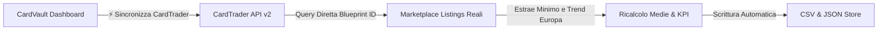

# 🃏 CardVault TCG - Guida Completa e Documentazione Tecnica

Benvenuto nella documentazione ufficiale di **CardVault TCG**, l'applicazione web professionale progettata per il tracciamento, il monitoraggio di mercato, il calcolo del valore e la gestione avanzata della collezione di carte collezionabili **Yu-Gi-Oh!**.

---

## 📑 Indice dei Contenuti
1. [Panoramica del Progetto](#1-panoramica-del-progetto)
2. [Cosa è Stato Realizzato (Funzionalità Complete)](#2-cosa-è-stato-realizzato-funzionalità-complete)
3. [Integrazione CardTrader API v2 & Blueprints Certificati](#3-integrazione-cardtrader-api-v2--blueprints-certificati)
4. [Integrazione YGOPRODeck API (Artwork HD & Metadati)](#4-integrazione-ygoprodeck-api-artwork-hd--metadati)
5. [Integrazione Multi-Marketplace (Cardmarket, JustTCG, eBay)](#5-integrazione-multi-marketplace-cardmarket-justtcg-ebay)
6. [Sistema di Sicurezza 2FA (Two-Factor Authentication)](#6-sistema-di-sicurezza-2fa-two-factor-authentication)
7. [Sincronizzazione File CSV su Disco](#7-sincronizzazione-file-csv-su-disco)
8. [Guida all'Uso Quotidiano (Locale e Cloud)](#8-guida-alluso-quotidiano-locale-e-cloud)
9. [Struttura dei File di Progetto](#9-struttura-dei-file-di-progetto)
10. [⚠️ ROADMAP & DA FARE: Revisione Logica Inserimento Nuove Carte](#10-️-roadmap--da-fare-revisione-logica-inserimento-nuove-carte)

---

## 1. Panoramica del Progetto

CardVault TCG nasce per superare i limiti dei tradizionali fogli di calcolo statici, trasformando il listino delle tue carte in una **dashboard finanziaria e collezionistica dinamica, reattiva e accessibile sia da PC che da Smartphone (4G/5G)**.

L'applicazione dialoga con i principali marketplace e database del settore:
- **CardTrader** (tramite API ufficiali v2 autenticate e Blueprint ID certificati)
- **YGOPRODeck** (database ufficiale per immagini HD, tipo mostro, statistiche ATK/DEF e testi degli effetti)
- **Cardmarket** (interrogazione tramite JustTCG per evitare blocchi Cloudflare e link mirati)
- **eBay.it** (monitoraggio dei venduti recenti e delle offerte Compralo Subito)

---

## 2. Cosa è Stato Realizzato (Funzionalità Complete)

### 📊 A. Dashboard Portfolio & Collector View
- **Doppia Vista Interattiva**:
  - **Tabella Gestionale**: Vista a righe compatta con codici, rarità, miniature e confronto prezzi a 3 colonne.
  - **Griglia Collector Cards**: Schede visive verticali con le **vere immagini ufficiali in HD**, finitura olografica (*foil shimmer*), badge rarità e tipo carta.
- **Lightbox HD Ingrandito**: Cliccando sull'artwork o sul nome di una carta si apre un modale a schermo intero con la carta in alta risoluzione, la descrizione completa dell'effetto, i prezzi live e i link diretti per l'acquisto.
- **Metriche KPI Live**:
  - Valore stimato totale del portafoglio (Media Trend e Minima reale).
  - Ripartizione del valore complessivo per marketplace (*Cardmarket*, *CardTrader*, *eBay*).
  - Barometro Trend di mercato (percentuale di carte in salita, stabili o in discesa).
  - Carta MVP del Portfolio (*pezzo a maggior valore di mercato*).
- **Filtri e Ricerca Rapida**: Ricerca istantanea per nome italiano/inglese o codice, filtro per Rarità (QCR, Ultimate, Ghost, Secret, Ultra, ecc.), Espansione, Condizione e Ordinamento.

### 🎯 B. Sezione Wants (Wishlist & Cacciatore di Affari)
- Tracciamento delle carte desiderate con **Prezzo Target (Budget Massimo)**.
- Rilevamento automatico della **Migliore Offerta di Mercato**.
- Badge visivi **"Affare! -€ X.XX"** quando il prezzo reale scende sotto il tuo target budget.
- Pulsante **"🚀 Segna come Acquistata"** per trasferire istantaneamente la carta dai Wants al Portfolio.

---

## 3. Integrazione CardTrader API v2 & Blueprints Certificati

Tutte le carte della collezione sono mappate sul loro **`blueprint_id` univoco ufficiale** di CardTrader.

### Vantaggi dell'Integrazione a Blueprint:
- **Zero Ambiguità**: Nessun errore di corrispondenza tra stampe simili, edizioni 1ª Edizione vs Illimitate o versioni Alternate Art.
- **Velocità Istantanea (< 50ms per carta)**: Interrogazione diretta dell'endpoint `/api/v2/marketplace/products?blueprint_id=...` senza dover scorrere liste di espansioni.
- **Reindirizzamento Diretto a 1 Clic**: Cliccando sull'icona di CardTrader, il browser apre direttamente la pagina del prodotto con tutte le copie in vendita.

---

## 4. Integrazione YGOPRODeck API (Artwork HD & Metadati)

CardVault si appoggia a **YGOPRODeck** (100% gratuito, senza chiavi API, fino a 15 req/sec):
- **Immagini Ufficiali**: Scarica automaticamente gli artwork in formato normale, large e cropped.
- **Dati di Gioco**: Tipo mostro (*Synchro*, *XYZ*, *Effect*, *Trap*), Archetipo (*Aesir*, *Despia*, ecc.), Livello/Rango, Attributo, ATK e DEF.
- **Testi degli Effetti**: Scheda descrittiva consultabile direttamente nell'app.
- **YGOPRODeck Hub**: Collegamento diretto alla pagina di riferimento della carta con tutti i set storici.

---

## 5. Integrazione Multi-Marketplace (Cardmarket, JustTCG, eBay)

- **`🌐 Sincronizza Mercati Globali`**: Nuovo pulsante dedicato per allineare in batch le immagini HD, i testi degli effetti e i prezzi base di YGOPRODeck, eBay e Cardmarket.
- **Supporto JustTCG (Opzionale)**: Nel modale `⚙️ API` puoi inserire la tua chiave di *justtcg.com* (1.000 chiamate/mese gratis) per estrarre le quotazioni specifiche di Cardmarket superando i blocchi Cloudflare Turnstile/403.
- **Link Intelligenti Localizzati**:
  - Cardmarket: ricerca mirata per nome internazionale e codice espansione.
  - eBay.it: query ottimizzata con filtro *Compralo Subito* abilitato.

---

## 6. Sistema di Sicurezza 2FA (Two-Factor Authentication)

Per proteggere la collezione quando pubblicata online (su Render o altri server Cloud):
1. **Master Password**: Cifratura `PBKDF2` con `SHA-512` e Salt crittografico a 16 byte.
2. **Codice OTP a 6 Cifre (RFC 6238 TOTP)**: Compatibile con **Google Authenticator**, **Microsoft Authenticator**, **Apple Passwords**, **Authy**.
3. **Sessioni Sicure (HMAC-SHA256)**: Token firmati salvati nel browser per un accesso fluido fino a 30 giorni.
4. **Protezione Backend**: Tutti gli endpoint di salvataggio e sincronizzazione (`POST /api/*`) rifiutano richieste non autenticate.

---

## 7. Sincronizzazione File CSV su Disco

Tutte le operazioni effettuate nell'app vengono scritte in tempo reale nel file:  
📁 **`C:\Users\fgava\Listino_Prezzi_Yugioh_Cardmarket_CardTrader.csv`**

- Formattazione standard italiana con punto e virgola (`;`) e virgola decimale (`48,50 €`).
- Calcolo automatico della riga finale con la somma dei totali.
- Doppio backup sincronizzato in formato JSON (`data_portfolio.json`) e JS (`cards-data.js`).

---

## 8. Guida all'Uso Quotidiano (Locale e Cloud)

### 🖥️ A. Utilizzo in Locale sul PC
1. Fai doppio clic su **`CardVault_TCG.bat`** sul tuo Desktop.
2. Il server si avvierà in background e aprirà il browser su **`http://localhost:3000`**.

### 📱 B. Utilizzo su Cloud & Telefono (Render.com)
1. Apri la cartella **`C:\Users\fgava\Desktop\CardVault_GitHub`**.
2. Carica i file sul tuo repository GitHub.
3. Render eseguirà il redeploy automatico in ~60 secondi e potrai accedere al tuo link pubblico da smartphone ovunque ti trovi!

---

## 9. Struttura dei File di Progetto

| File | Scopo e Contenuto |
| :--- | :--- |
| **`server.js`** | Server HTTP Node.js. Gestisce sync CSV, CardTrader API v2 a blueprint, YGOPRODeck, JustTCG e 2FA TOTP. |
| **`index.html`** | Struttura dell'interfaccia: pulsanti dedicati CardTrader e Mercati Globali, modali API, Lightbox HD e 2FA. |
| **`style.css`** | Design System Dark Luxury (Outfit + Plus Jakarta Sans), palette HSL, Collector Grid, Lightbox ed effetti foil. |
| **`app.js`** | Motore frontend: gestione collezione, calcolo medie, filtri, eventi, modali e chiamate API. |
| **`cards-data.js`** | Database iniziale master con le **36 carte certificate** (Blueprint CT + Artwork YGOPRODeck). |
| **`data_portfolio.json`** | Archivio dati JSON persistente letto e scritto dal server. |
| **`Listino_Prezzi_Yugioh_Cardmarket_CardTrader.csv`** | File CSV master collegato su disco. |
| **`CardVault_TCG.bat`** | File di avvio rapido per Windows. |

---

## 10. ⚠️ ROADMAP & DA FARE: Revisione Logica Inserimento Nuove Carte

> [!IMPORTANT]
> **Punto Aperto per il Prossimo Step di Sviluppo:**  
> L'attuale modale di inserimento carta (`#card-form`) richiede la compilazione manuale dei campi testo (espansione, rarità, codici, prezzi) e non associa automaticamente il `blueprintId` di CardTrader né l'immagine HD di YGOPRODeck.

### 🛠️ Nuova Logica di Inserimento da Implementare:

1. **Inserimento tramite Link CardTrader (1-Click Auto-Fill)**:
   - Nel form di aggiunta carta, inserire un campo prioritario: **`🔗 Incolla Link CardTrader`** (es. `https://www.cardtrader.com/it/cards/328546-aluber-...`).
   - L'utente incolla il link della carta ➔ Il server estrae immediatamente l'ID blueprint (`328546`), interroga l'API di CardTrader ed estrae in automatico:
     - Nome Ufficiale Inglese ed Espansione
     - Codice Carta e Rarità esatta
     - Prezzo minimo reale e numero di inserzioni
   - In parallelo interroga **YGOPRODeck** per:
     - Scaricare l'artwork ufficiale in HD
     - Scaricare il tipo di carta, archetipo e testo dell'effetto
     - Assegnare il nome tradotto in italiano
   - **Risultato**: La carta viene creata, calibrata e salvata nel CSV e nel database **in meno di 1 secondo senza dover digitare nulla a mano!**

2. **Ricerca Live con Autocompletamento**:
   - In alternativa al link, una barra di ricerca che suggerisce le carte disponibili mentre digiti (tramite YGOPRODeck / CardTrader search) e permette di selezionare l'espansione e la rarità da un menu visivo.

---

*Documentazione aggiornata per CardVault TCG • Master Collection 36 Carte • Realizzato per Fgavagnin.*
