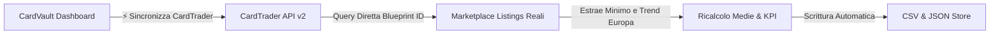

# 🃏 CardVault TCG - Guida Completa e Documentazione Tecnica

Benvenuto nella documentazione ufficiale di **CardVault TCG**, l'applicazione web professionale progettata per il tracciamento, il monitoraggio di mercato, il calcolo del valore e la gestione avanzata della collezione di carte collezionabili **Yu-Gi-Oh!**.

---

## 📑 Indice dei Contenuti
1. [Panoramica del Progetto](#1-panoramica-del-progetto)
2. [Cosa è Stato Realizzato (Funzionalità Complete)](#2-cosa-è-stato-realizzato-funzionalità-complete)
3. [Integrazione CardTrader API v2 & Blueprints Certificati](#3-integrazione-cardtrader-api-v2--blueprints-certificati)
4. [Integrazione YGOPRODeck API (Artwork HD & Metadati)](#4-integrazione-ygoprodeck-api-artwork-hd--metadati)
5. [Integrazione Multi-Marketplace (Cardmarket, JustTCG, eBay)](#5-integrazione-multi-marketplace-cardmarket-justtcg-ebay)
6. [Sistema di Sicurezza 2FA (Two-Factor Authentication)](#6-sistema-di-sicurezza-2fa-two-factor-authentication)
7. [Sincronizzazione File CSV su Disco](#7-sincronizzazione-file-csv-su-disco)
8. [Guida all'Uso Quotidiano (Locale e Cloud)](#8-guida-alluso-quotidiano-locale-e-cloud)
9. [Struttura dei File di Progetto](#9-struttura-dei-file-di-progetto)
10. [⚠️ ROADMAP & DA FARE: Revisione Logica Inserimento Nuove Carte](#10-️-roadmap--da-fare-revisione-logica-inserimento-nuove-carte)

---

## 1. Panoramica del Progetto

CardVault TCG nasce per superare i limiti dei tradizionali fogli di calcolo statici, trasformando il listino delle tue carte in una **dashboard finanziaria e collezionistica dinamica, reattiva e accessibile sia da PC che da Smartphone (4G/5G)**.

L'applicazione dialoga con i principali marketplace e database del settore:
- **CardTrader** (tramite API ufficiali v2 autenticate e Blueprint ID certificati)
- **YGOPRODeck** (database ufficiale per immagini HD, tipo mostro, statistiche ATK/DEF e testi degli effetti)
- **Cardmarket** (interrogazione tramite JustTCG per evitare blocchi Cloudflare e link mirati)
- **eBay.it** (monitoraggio dei venduti recenti e delle offerte Compralo Subito)

---

## 2. Cosa è Stato Realizzato (Funzionalità Complete)

### 📊 A. Dashboard Portfolio & Collector View
- **Doppia Vista Interattiva**:
  - **Tabella Gestionale**: Vista a righe compatta con codici, rarità, miniature e confronto prezzi a 3 colonne.
  - **Griglia Collector Cards**: Schede visive verticali con le **vere immagini ufficiali in HD**, finitura olografica (*foil shimmer*), badge rarità e tipo carta.
- **Lightbox HD Ingrandito**: Cliccando sull'artwork o sul nome di una carta si apre un modale a schermo intero con la carta in alta risoluzione, la descrizione completa dell'effetto, i prezzi live e i link diretti per l'acquisto.
- **Metriche KPI Live**:
  - Valore stimato totale del portafoglio (Media Trend e Minima reale).
  - Ripartizione del valore complessivo per marketplace (*Cardmarket*, *CardTrader*, *eBay*).
  - Barometro Trend di mercato (percentuale di carte in salita, stabili o in discesa).
  - Carta MVP del Portfolio (*pezzo a maggior valore di mercato*).
- **Filtri e Ricerca Rapida**: Ricerca istantanea per nome italiano/inglese o codice, filtro per Rarità (QCR, Ultimate, Ghost, Secret, Ultra, ecc.), Espansione, Condizione e Ordinamento.

### 🎯 B. Sezione Wants (Wishlist & Cacciatore di Affari)
- Tracciamento delle carte desiderate con **Prezzo Target (Budget Massimo)**.
- Rilevamento automatico della **Migliore Offerta di Mercato**.
- Badge visivi **"Affare! -€ X.XX"** quando il prezzo reale scende sotto il tuo target budget.
- Pulsante **"🚀 Segna come Acquistata"** per trasferire istantaneamente la carta dai Wants al Portfolio.

---

## 3. Integrazione CardTrader API v2 & Blueprints Certificati

Tutte le carte della collezione sono mappate sul loro **`blueprint_id` univoco ufficiale** di CardTrader.

### Vantaggi dell'Integrazione a Blueprint:
- **Zero Ambiguità**: Nessun errore di corrispondenza tra stampe simili, edizioni 1ª Edizione vs Illimitate o versioni Alternate Art.
- **Velocità Istantanea (< 50ms per carta)**: Interrogazione diretta dell'endpoint `/api/v2/marketplace/products?blueprint_id=...` senza dover scorrere liste di espansioni.
- **Reindirizzamento Diretto a 1 Clic**: Cliccando sull'icona di CardTrader, il browser apre direttamente la pagina del prodotto con tutte le copie in vendita.

---

## 4. Integrazione YGOPRODeck API (Artwork HD & Metadati)

CardVault si appoggia a **YGOPRODeck** (100% gratuito, senza chiavi API, fino a 15 req/sec):
- **Immagini Ufficiali**: Scarica automaticamente gli artwork in formato normale, large e cropped.
- **Dati di Gioco**: Tipo mostro (*Synchro*, *XYZ*, *Effect*, *Trap*), Archetipo (*Aesir*, *Despia*, ecc.), Livello/Rango, Attributo, ATK e DEF.
- **Testi degli Effetti**: Scheda descrittiva consultabile direttamente nell'app.
- **YGOPRODeck Hub**: Collegamento diretto alla pagina di riferimento della carta con tutti i set storici.

---

## 5. Integrazione Multi-Marketplace (Cardmarket, JustTCG, eBay)

- **`🌐 Sincronizza Cardmarket & Mercati`**: Pulsante dedicato per allineare in batch o per singola carta le immagini HD, i testi degli effetti e i prezzi base di YGOPRODeck, eBay e Cardmarket.
- **Integrazione JustTCG con Hierarchical Scoring Matcher**:
  - Risolto il rischio di mismatch tra diverse rarità dello stesso set (es. *Ghost Rare* vs *Ultra Rare* nello stesso set STOR-040).
  - Algoritmo di scoring ponderato che abbina con precisione **Codice Carta (+50 pt)**, **Rarità Esatta (+45 pt)** ed **Espansione (+25 pt)** con penalità di sicurezza per evitare di sovrascrivere pezzi da collezione con ristampe o stampe comuni.
  - Conversione automatica USD ➔ EUR per le varianti *Near Mint* e *1ª Edizione*.
- **Monitoraggio Quota Mensile JustTCG**:
  - Badge interattivo **🌐 JustTCG** sempre visibile nell'header (`X / 1000 usate`, `Y rimaste`).
  - Tracciamento persistente su file `.justtcg_usage.json` con soglia di allerta (> 500 chiamate) e reset automatico al 1° del mese solare.
  - Multi-path fallback per funzionamento trasparente sia in locale che su Cloud Render.

---

## 6. Sistema di Timestamp & Smart Merge (Persistenza Sicura)

- **Tracciamento Temporale a Singola Carta (`updatedAt`)**:
  - Ogni carta e want possiede un timestamp ISO 8601 univoco aggiornato ad ogni modifica manuale, sincronizzazione API o ricalcolo.
  - Salvataggio e propagazione automatica su `data_portfolio.json`, `cards-data.js` e sul file CSV master.
- **Algoritmo di Smart Merge**:
  - All'apertura dell'applicazione, il client confronta i timestamp locali del browser (`localStorage`) con quelli del server/disco.
  - La versione con timestamp più recente per ciascuna carta vince sempre, prevenendo la perdita di modifiche e garantendo che le carte mostrino sempre i dati più aggiornati.
- **Filtri di Ordinamento per Data**:
  - Aggiunti i criteri di ordinamento `🕒 Modifica più recente` e `🕒 Modifica meno recente` nei selettori di ordinamento Portfolio e Wants.

---

## 7. Sistema di Sicurezza 2FA (Two-Factor Authentication)

Per proteggere la collezione quando pubblicata online (su Render o altri server Cloud):
1. **Master Password**: Cifratura `PBKDF2` con `SHA-512` e Salt crittografico a 16 byte.
2. **Codice OTP a 6 Cifre (RFC 6238 TOTP)**: Compatibile con **Google Authenticator**, **Microsoft Authenticator**, **Apple Passwords**, **Authy**.
3. **Sessioni Sicure (HMAC-SHA256)**: Token firmati salvati nel browser per un accesso fluido fino a 30 giorni.
4. **Protezione Backend**: Tutti gli endpoint di salvataggio e sincronizzazione (`POST /api/*`) rifiutano richieste non autenticate.

---

## 8. Sincronizzazione File CSV su Disco

Tutte le operazioni effettuate nell'app vengono scritte in tempo reale nel file:  
📁 **`C:\Users\fgava\Listino_Prezzi_Yugioh_Cardmarket_CardTrader.csv`**

- Formattazione standard italiana con punto e virgola (`;`) e virgola decimale (`48,50 €`).
- Calcolo automatico della riga finale con la somma dei totali.
- Doppio backup sincronizzato in formato JSON (`data_portfolio.json`) e JS (`cards-data.js`).

---

## 9. Guida all'Uso Quotidiano (Locale e Cloud)

### 🖥️ A. Utilizzo in Locale sul PC
1. Fai doppio clic su **`CardVault_TCG.bat`** sul tuo Desktop.
2. Il server si avvierà in background e aprirà il browser su **`http://localhost:3000`**.

### 📱 B. Utilizzo su Cloud & Telefono (Render.com)
1. Apri la dashboard del tuo servizio su **Render.com**.
2. Nelle variabili d'ambiente (**Environment**) imposta:
   - `JUSTTCG_API_KEY`: `tcg_f0527f27d0f34dfa9c3480fa16e4e286`
   - `CARDTRADER_TOKEN`: (il tuo Bearer Token di CardTrader)
3. Apri **`https://cardvault-tcg.onrender.com`** da smartphone o PC.
4. **Accesso Sicuro 2FA**:
   - Inserisci il tuo **Master PIN / Password** e il **Codice a 6 cifre dall'app Google Authenticator**.
   - Con la spunta *"Ricorda questo dispositivo (30 giorni)"* attiva, il tuo smartphone/browser resterà sbloccato per un mese intero senza dover reinserire le credenziali ad ogni apertura.

---

## 10. Struttura dei File di Progetto

| File | Scopo e Contenuto |
| :--- | :--- |
| **`server.js`** | Server HTTP Node.js. Gestisce sync CSV, CardTrader API v2 a blueprint con filtro ITA/NM, lookup automatico 1-Click (`/api/cardtrader/lookup-blueprint`), YGOPRODeck, JustTCG API con quota tracker mensile, matching gerarchico per rarità e 2FA TOTP. |
| **`index.html`** | Struttura dell'interfaccia: box 1-Click Auto-Fill CardTrader, pulsanti dedicati CardTrader e Cardmarket Live, contatore quota JustTCG, modali API, Lightbox HD e 2FA. |
| **`style.css`** | Design System Dark Luxury, box auto-fill, badge timestamp, indicatori trend, Lightbox, dropup automatici e monitor quota. |
| **`app.js`** | Motore frontend: 1-Click Auto-Fill, reindirizzamento mirato Cardmarket con filtro lingua, smart merge per timestamp, calcolo medie, filtri, eventi, modali e chiamate API. |
| **`cards-data.js`** | Database iniziale master con le **36 carte certificate** (Blueprint CT + Artwork YGOPRODeck + Timestamps). |
| **`data_portfolio.json`** | Archivio dati JSON persistente letto e scritto dal server. |
| **`.justtcg_token`** | File protetto con l'API Key JustTCG dell'utente. |
| **`.justtcg_usage.json`** | Monitoraggio persistente delle chiamate mensili JustTCG (limite 1.000, soglia alert 500, reset mensile automatico). |
| **`Listino_Prezzi_Yugioh_Cardmarket_CardTrader.csv`** | File CSV master collegato su disco. |
| **`CardVault_TCG.bat`** | File di avvio rapido per Windows. |

---

## 11. ✨ Funzionalità Avanzate Completate: 1-Click Auto-Fill & Reindirizzamento Mirato

### 🔗 1. Inserimento Nuove Carte tramite Link CardTrader (1-Click Auto-Fill)
- **Box Dedicato nei Modali Portfolio & Wants**:  
  Nel form di aggiunta/modifica carta è presente il box **"⚡ Compila Automatica 1-Click con CardTrader & YGOPRODeck"**.
- **Funzionamento**:
  1. Incolla qualsiasi URL di CardTrader (es. `https://www.cardtrader.com/it/cards/80186-odin-father-of-the-aesir...`) o digita direttamente l'ID numerico del Blueprint (es. `80186`).
  2. L'endpoint backend `POST /api/cardtrader/lookup-blueprint` estrae il Blueprint ID, interroga CardTrader API v2 per nome inglese, rarità ed espansione, e interroga in parallelo YGOPRODeck per estrarre artwork HD, statistiche mostro (ATK, DEF, Tipo, Livello, Attributo, Descrizione) e il codice carta corrispondente.
  3. Il codice carta viene convertito automaticamente nella lingua target (es. `STOR-EN040` ➔ `STOR-IT040` per l'Italiano).
  4. Vengono calcolate e compilate istantaneamente le quotazioni in tempo reale: **CardTrader Min & Trend**, **Cardmarket Min & Trend**, ed **eBay.it**.
  5. Tutti i metadati (`blueprintId`, `cardTraderUrl`, `ygoprodeckUrl`, artwork HD) vengono salvati in modo permanente nel database JSON e nel CSV.

---

### 🌐 2. Filtro per Lingua & Reindirizzamento Mirato per Cardmarket
- **Parametri di Lingua Ufficiali Cardmarket (`idLanguage`)**:
  - `Italiano (ITA)` ➔ `&idLanguage=5`
  - `Inglese (EN)` ➔ `&idLanguage=1`
  - `Tedesco (DE)` ➔ `&idLanguage=3`
  - `Francese (FR)` ➔ `&idLanguage=2`
  - `Spagnolo (ES)` ➔ `&idLanguage=4`
  - `Giapponese (JP)` ➔ `&idLanguage=6`
- **Ricerche Dirette & Reindirizzamenti**:
  - Il link primario di **Cardmarket** punta direttamente alla combinazione esatta di **Codice Carta + Filtro Lingua** (es. `STOR-IT040&idLanguage=5`), portando subito alle inserzioni specifiche senza dispersioni.
  - Il link di **CardTrader** punta direttamente alla pagina ufficiale del Blueprint (`/it/cards/:slug` o `/it/cards/:id`), mostrando con 1 clic tutte le copie fisiche in vendita in Europa.
  - Il link di **eBay.it** imposta automaticamente la ricerca filtrata con `LH_BIN=1` (*Compralo Subito*) per codice e nome carta.

---

## 12. 🌌 Supporto Multi-TCG & Separazione per Brand (Pokémon, Magic, Yu-Gi-Oh!)

CardVault supporta l'universo multi-gioco collezionistico consentendo di gestire nello stesso account collezioni separate e filtrate per brand:

### 🎮 Giochi & TCG Supportati
1. **🎴 Yu-Gi-Oh!**: Database YGOPRODeck + CardTrader Blueprint (Game ID 4) + Cardmarket `/YuGiOh/`
2. **⚡ Pokémon**: Artwork HD CardTrader CDN + Cardmarket `/Pokemon/` + eBay Pokémon
3. **🧙 Magic: The Gathering**: Database Scryfall API HD scansioni + CardTrader Blueprint (Game ID 1) + Cardmarket `/Magic/` + Scryfall Oracle Text & Mana
4. **🏴‍☠️ One Piece Card Game**: CardTrader (Game ID 15) + Cardmarket `/OnePiece/`
5. **✨ Disney Lorcana**: CardTrader (Game ID 18) + Cardmarket `/Lorcana/`

### 🏷️ Filtro Rapido per Brand (Pills Navigation Bar)
- Una barra interattiva posizionata nella testata consente di passare con 1 clic dalla vista **🌐 Tutti i Giochi** ai singoli brand (**🎴 Yu-Gi-Oh!**, **⚡ Pokémon**, **🧙 Magic: The Gathering**, **🏴‍☠️ One Piece**).
- I contatori su ciascuna pillola e tutti i **KPI finanziari (Valore Stimato, Trend, Spesa Minima, MVP)** si ricalcolano istantaneamente isolando il brand selezionato.
- Ogni riga della tabella e ogni scheda della griglia mostrano il badge colorato corrispondente al brand (`[🎴 YGO]`, `[⚡ PKM]`, `[🧙 MTG]`, etc.).

---

*Documentazione aggiornata per CardVault TCG Multi-TCG Edition • Master Collection • Realizzato per Fgavagnin.*
