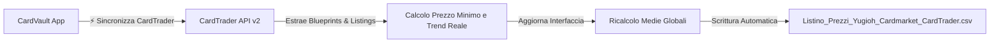

# 🃏 CardVault TCG - Guida Completa e Documentazione Tecnica

Benvenuto nella documentazione ufficiale di **CardVault TCG**, l'applicazione web professionale progettata per il tracciamento, monitoraggio di mercato, calcolo del valore e gestione della collezione di carte collezionabili **Yu-Gi-Oh!**.

---

## 📑 Indice dei Contenuti
1. [Panoramica del Progetto](#1-panoramica-del-progetto)
2. [Cosa è Stato Realizzato (Funzionalità)](#2-cosa-è-stato-realizzato-funzionalità)
3. [Integrazione CardTrader API v2](#3-integrazione-cardtrader-api-v2)
4. [Sistema di Sicurezza 2FA (Two-Factor Authentication)](#4-sistema-di-sicurezza-2fa)
5. [Sincronizzazione File CSV su Disco](#5-sincronizzazione-file-csv-su-disco)
6. [Guida all'Uso Quotidiano (Locale e Cloud)](#6-guida-alluso-quotidiano)
7. [Struttura dei File di Progetto](#7-struttura-dei-file-di-progetto)

---

## 1. Panoramica del Progetto

CardVault TCG nasce per superare i limiti dei tradizionali fogli di calcolo statici, trasformando il listino delle tue carte in una **dashboard dinamica, reattiva e accessibile sia da PC che da Smartphone (4G/5G)**.

L'applicazione dialoga in tempo reale con i principali marketplace di settore:
- **CardTrader** (tramite API ufficiali autenticate)
- **Cardmarket** (con query localizzate in lingua italiana `/it/`)
- **eBay.it** (con ricerche mirate per lingua, codice espansione e vendite recenti)

---

## 2. Cosa è Stato Realizzato (Funzionalità)

### 📊 A. Dashboard Portfolio & Collector View
- **Doppia Vista**: Passaggio immediato tra **Tabella Dettagliata** (stile gestionale) e **Griglia Collector Cards** (schede visive con badge rarità e finiture olografiche).
- **Metriche KPI Live**:
  - Valore stimato totale del portafoglio (Media Trend e Minima).
  - Ripartizione del valore complessivo per bacino (*Cardmarket*, *CardTrader*, *eBay*).
  - Barometro Trend di mercato (carte in rialzo, stabili, in calo).
  - Carta Top del Portfolio (*MVP per valore di mercato*).
- **Filtri e Ricerca Avanzata**: Ricerca istantanea per nome italiano/inglese, filtro per Rarità (QCR, Ultimate, Ghost, Secret, Ultra), Espansione, Condizione e Ordinamento.

### 🎯 B. Sezione Wants (Wishlist & Cacciatore di Affari)
- Tracciamento delle carte desiderate con **Prezzo Target (Budget Massimo)**.
- Rilevamento automatico della **Migliore Offerta di Mercato**.
- Badge visivi **"Affare! -€ X.XX"** quando il prezzo reale scende sotto il tuo target budget.
- Pulsante **"🚀 Segna come Acquistata"** per trasferire la carta direttamente dai Wants al Portfolio posseduto.

### 📈 C. Micro-Trend per Singolo Marketplace
Ogni colonna di mercato mostra ora un indicatore visivo dedicato:
- 🟢 **`↗` (Verde)**: Prezzo in forte crescita o scambiato a premio rispetto al minimo (*Bullish*).
- 🔴 **`↘` (Rosso)**: Prezzo in discesa o a ridosso del minimo di svendita (*Bearish*).
- ⚪ **`↔` (Grigio)**: Mercato stabile ed equilibrato.
- Tooltip informativo con percentuale esatta al passaggio del mouse.

---

## 3. Integrazione CardTrader API v2

L'applicazione integra l'accesso autenticato alle API ufficiali di CardTrader tramite il token utente dell'applicazione **Fgavagnin App**.

### Caratteristiche del Modulo Sync:
- **Corrispondenza Blueprints**: Riconoscimento automatico delle espansioni (es. `SOI`, `STOR`, `LC5D`, `SECE`, `RA03`, `RA04`, `CRMS`, `DAMA`) e delle versioni/rarità.
- **Sincronizzazione Massiva (`⚡ Sincronizza CardTrader (Live)`)**: Aggiorna tutte le 29 carte con finestra di avanzamento in tempo reale e report comparativo (Vecchio Prezzo ➔ Nuovo Prezzo).
- **Sincronizzazione Singola (`⚡`)**: Icona a fulmine presente su ogni riga per aggiornare la singola carta in 1 secondo.

---

## 4. Sistema di Sicurezza 2FA (Two-Factor Authentication)

Per proteggere la collezione da accessi non autorizzati (soprattutto quando pubblicata online sul Cloud), è stato implementato un sistema di sicurezza **a Due Fattori standard RFC 6238 TOTP**:

1. **Master Password**: Password cifrata tramite algoritmo crittografico `PBKDF2` con `SHA-512` e Salt casuale a 16 byte.
2. **Codice OTP a 6 Cifre**: Generato ogni 30 secondi tramite app di autenticazione (**Google Authenticator**, **Microsoft Authenticator**, **Apple Passwords**, **Authy**).
3. **Sessioni Sicurate (HMAC)**: Generazione di token crittografici firmati con validità fino a 30 giorni per i dispositivi personali fidati.
4. **Pulsante `🔒 Blocca`**: Permette di bloccare la sessione istantaneamente in qualsiasi momento.
5. **Protezione Backend**: Tutte le API di modifica e sincronizzazione rifiutano chiamate non autenticate (`401 Unauthorized`).

---

## 5. Sincronizzazione File CSV su Disco

Tutte le operazioni effettuate nell'app vengono scritte in modo trasparente e immediato nel file fisico:  
📁 **`C:\Users\fgava\Listino_Prezzi_Yugioh_Cardmarket_CardTrader.csv`**

- **Salvataggio Continuo**: Ogni aggiunta, modifica, eliminazione o sincronizzazione prezzi riscrive il file con il formato corretto, formattando i numeri in standard italiano (`48,50`) e ricalcolando la riga `TOTALE LOTTO` a fondo foglio.
- **Import/Export**: Pulsanti dedicati per caricare un file CSV esterno o scaricare copie di backup.

---

## 6. Guida all'Uso Quotidiano

### 🖥️ A. Utilizzo in Locale sul PC
1. Fai doppio clic sull'icona sul Desktop: **`CardVault_TCG.bat`**.
2. Il server si avvierà in background e aprirà automaticamente il browser su **`http://localhost:3000`**.
3. Per spegnerlo, chiudi semplicemente la finestra nera del terminale.

### 📱 B. Utilizzo su Smartphone tramite Wi-Fi di Casa
1. Con il server avviato sul PC, apri il browser del telefono (collegato allo stesso Wi-Fi).
2. Digita: **`http://192.168.178.86:3000`**.

### ☁️ C. Utilizzo su Cloud 24/7 (Render.com)
1. Carica i file della cartella `CardVault_GitHub` sul tuo repository GitHub.
2. Render eseguirà il deploy in automatico fornendoti il tuo link pubblico sicuro (es. `https://cardvault-tcg.onrender.com`).
3. Dal telefono puoi salvare il link come icona sulla **schermata Home** per usarlo come una vera App nativa ovunque tu sia.

---

## 7. Struttura dei File di Progetto

| File | Scopo e Contenuto |
| :--- | :--- |
| **`server.js`** | Server HTTP Node.js (Zero-dipendenze). Gestisce sincronizzazione CSV, integrazione CardTrader API v2 e validazione 2FA TOTP. |
| **`index.html`** | Struttura semantica della dashboard, modali di aggiunta/modifica, modale sync CardTrader e overlay di sicurezza 2FA. |
| **`style.css`** | Design system Dark Luxury (Outfit + Plus Jakarta Sans), palette HSL, animazioni, layout fluidi e responsive mobile. |
| **`app.js`** | Motore logico frontend: calcolo medie, filtri, gestione sessioni 2FA, eventi e chiamate API. |
| **`cards-data.js`** | Database iniziale di fallback (29 carte portfolio con nomi IT/EN corretti e 5 carte wants). |
| **`package.json`** | Configurazione Node.js per il deploy su Render/Cloud. |
| **`render.yaml`** | Manifesto di configurazione automatica per Render.com. |
| **`CardVault_TCG.bat`** | File di avvio rapido 1-clic sul Desktop per Windows. |
| **`Condividi_Su_Telefono_Online.bat`** | Script per generare un tunnel HTTPS sicuro per il telefono senza installare nulla. |

---

*Documentazione generata per CardVault TCG • Realizzato per Fgavagnin.*
